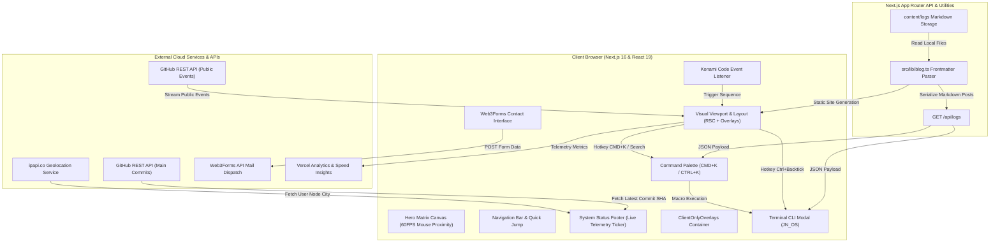

<div align="center">

# ⚡ JN LABS // PORTFOLIO & SYSTEM ARCHITECTURE

[](https://nextjs.org/)
[](https://react.dev/)
[](https://www.typescriptlang.org/)
[](https://tailwindcss.com/)
[](https://www.framer.com/motion/)
[](https://playwright.dev/)
[](https://vercel.com/)
[](LICENSE)

<p align="center">
  <strong>An industry-grade, cyber-terminal portfolio and execution showcase engineering autonomous AI systems, scalable full-stack architectures, and zero-friction automations.</strong>
</p>

<p align="center">
  <a href="https://jamalnadeem.com"><strong>🌐 Explore Live Production Deployment</strong></a> •
  <a href="#-key-features"><strong>✨ Key Features</strong></a> •
  <a href="#️-architecture--data-flow"><strong>🏗️ Architecture</strong></a> •
  <a href="#-getting-started--installation"><strong>💻 Quick Start</strong></a> •
  <a href="#-available-scripts"><strong>📜 Scripts</strong></a>
</p>

---

</div>

## 📑 Table of Contents

- [⚡ Project Highlights](#-project-highlights)
- [🎯 Project Overview](#-project-overview)
- [🚀 Key Features](#-key-features)
  - [🖥️ Interactive Terminal CLI (`JN_OS`)](#️-interactive-terminal-cli-jn_os)
  - [🔍 Global Command Palette (`⌘K` / `Ctrl+K`)](#-global-command-palette-k--ctrlk)
  - [🌧️ Mouse-Interactive Matrix Digital Rain](#️-mouse-interactive-matrix-digital-rain)
  - [📡 Real-Time Live GitHub Activity Stream](#-real-time-live-github-activity-stream)
  - [⚡ Live Telemetry & System Status Footer](#-live-telemetry--system-status-footer)
  - [📝 Zero-Dependency Markdown Execution Logs Engine](#-zero-dependency-markdown-execution-logs-engine)
  - [🎨 Cyberpunk Visual Design & Custom Motion Physics](#-cyberpunk-visual-design--custom-motion-physics)
  - [🎮 Konami Code Easter Egg & God Mode](#-konami-code-easter-egg--god-mode)
  - [📬 Automated Web3Forms Contact Integration](#-automated-web3forms-contact-integration)
  - [🛡️ Fault-Tolerant Error & 404 Kernel Recovery](#️-fault-tolerant-error--404-kernel-recovery)
- [🏗️ Architecture & Data Flow](#️-architecture--data-flow)
- [🛠️ Tech Stack Matrix](#️-tech-stack-matrix)
- [📂 Project Structure](#-project-structure)
- [💻 Getting Started & Installation](#-getting-started--installation)
- [📜 Available Scripts](#-available-scripts)
- [🌐 Live Demo & Deployment](#-live-demo--deployment)
- [👨‍💻 Author & Attribution](#-author--attribution)
- [📄 License](#-license)

---

## ⚡ Project Highlights

> [!IMPORTANT]
> **Production Core Philosophy**: *"If a task can be predicted, it can be automated."*
> 
> This web application is not just a visual portfolio—it is built as an interactive, fully responsive **cybernetic operating system (`JN_OS`)**. It combines server-side dynamic imports, zero-dependency Markdown parsing, real-time GitHub event telemetry, and keyboard-first developer navigation.

> [!NOTE]
> **Hydration-Safe Architecture**: All client-side browser interactive elements (Terminal CLI, Command Palette, Konami Code listener, and Scroll Progress bar) are decoupled into a dedicated `ClientOnlyOverlays` provider with Next.js dynamic imports (`ssr: false`) to guarantee zero SSR hydration mismatches and lightning-fast First Contentful Paint (FCP).

---

## 🎯 Project Overview

**JN LABS Portfolio** is the official portfolio and technical repository of **Jamal Nadeem**, Team Lead of CRM & Agentic AI at EditVista Ltd and Computer Science graduate from Sir Syed University of Engineering & Technology (SSUET).

The application is engineered using **Next.js 16 (App Router)**, **React 19**, **TypeScript 5**, **Tailwind CSS 4**, and **Framer Motion 12**, deployed globally to **Vercel's Edge Network**. It bridges modern high-performance web engineering with an authentic retro-cyberpunk command-line aesthetic, highlighting production systems in Agentic AI, autonomous workflows, real-time code evaluation, and enterprise CRM pipelines.

### Key Architectural Pillars
- **Hybrid Rendering Model**: Utilizes React Server Components (RSC) for critical layout, SEO metadata, and blog content rendering, paired with client-side reactive overlays loaded below the fold for optimal Interaction to Next Paint (INP).
- **Zero Heavy Runtime Bloat**: Implements custom regex-based YAML frontmatter parsing and lightweight Markdown rendering without heavy runtime markdown compilers.
- **Resilient Fallbacks**: Integrated failover mechanisms for GitHub REST API rate limits, avatar asset loading errors, and asynchronous network disconnections.
- **Enterprise Testing**: Fully covered with end-to-end (E2E) automated test suites via **Playwright**, validating visual components, DOM mutations, scroll animations, telemetry tickers, and network payload interception.

---

## 🚀 Key Features

### 🖥️ Interactive Terminal CLI (`JN_OS`)
- **Hotkey & UI Trigger**: Openable anytime via `Ctrl + \`` shortcut or via the floating terminal button in the bottom-right corner.
- **14+ Built-in Shell Commands**:
  - `help` — Lists all executable system commands.
  - `whoami` — Displays guest user privilege level.
  - `skills` — Outputs technical competencies across Frontend, Backend, and AI.
  - `resume` / `cv` — Prints structured resume details directly in the console and auto-launches the official PDF.
  - `ls [dir]` — Lists directory partitions (e.g. `ls logs` dynamically queries published articles).
  - `cat [file]` — Streams markdown files line-by-line (`cat resume.md`, `cat about.md`, `cat skills.json`, `cat deploy.sh`, `cat logs/<slug>.md`).
  - `ping` — Calculates dynamic synthetic network latency in milliseconds.
  - `uptime`, `date`, `pwd`, `echo [arg]` — Authentic POSIX shell command behaviors.
  - `godmode` — Triggers root access override sequence.
  - `sudo rm -rf` — Protected easter egg handler with permission denied alert.
  - `clear`, `exit` — Clears buffer logs or closes the terminal modal.
- **Visual FX**: Features simulated CRT scanlines, auto-scroll ref tracking, animated cursor blinking, and controllable typewriter output streaming (`printLinesSlowly`).

### 🔍 Global Command Palette (`⌘K` / `Ctrl+K`)
- **Instant Keyboard Navigation**: Global listener for `CMD+K` (macOS) or `CTRL+K` (Windows/Linux) with platform-specific keyboard glyph detection.
- **Full-Text Filtering**: Real-time fuzzy query filtering across internal sections, direct resume downloads, and live log posts.
- **Macro Command Routing (`>`)**: Typing `>` instantly bridges the search input to the terminal execution engine (e.g., `> whoami`, `> ping`, `> godmode`).
- **Keyboard Traversal**: Fully operable with `↑`, `↓`, `Enter`, and `Escape` keys.

### 🌧️ Mouse-Interactive Matrix Digital Rain
- **HTML5 Canvas Background**: Full-screen matrix digital rain running at 60 FPS via `requestAnimationFrame`.
- **Proximity Lighting Physics**: Calculates Euclidean distance from the user's cursor (`dx² + dy² < radius²`), dynamically boosting character opacity to `#39FF14` with radiant text-shadow bloom upon cursor approach.
- **Adaptive Screen Resizing**: Dynamically recalibrates column densities and vertical stagger drops on viewport resize events.

### 📡 Real-Time Live GitHub Activity Stream
- **REST API Telemetry**: Direct client fetch to `https://api.github.com/users/beginnercodee/events/public`.
- **Event Translation**: Intelligently classifies and formats raw events (`PushEvent`, `CreateEvent`, `WatchEvent`, `IssuesEvent`, `PullRequestEvent`) with exact UTC timestamp markers.
- **Rolling FIFO Buffer**: Automatically pushes new events into a rolling 5-slot terminal buffer at 1200ms intervals with animated CRT scanlines.

### ⚡ Live Telemetry & System Status Footer
- **Real-Time Synchronized Clock**: Live 24-hour UTC timestamp updater running at 60-second intervals.
- **Simulated Hardware Metrics**: Dynamic CPU load simulation (5%–15% nominal load with 5% spike probability), memory allocation tracking (1.0GB–1.8GB), and jittered latency ticker (8ms–25ms).
- **Live Vercel/GitHub Build SHA**: Queries GitHub Commits API for the latest commit on `main`, displaying the commit SHA hash and relative deployment age (`<1H AGO`, `2D AGO`) with direct link to GitHub.
- **IP Geolocation Tracing**: Asynchronously queries `ipapi.co` to trace the visitor's city and country code, displaying it in the HUD.
- **Tab Visibility Tracker**: Detects browser tab focus shifts and toggles document title between `"System Waiting..."` and `"Jamal Nadeem | Automation Engineer"`.

### 📝 Zero-Dependency Markdown Execution Logs Engine
- **Lightweight Frontmatter Parser**: Custom regex parser extracting YAML metadata (`title`, `date`, `tags`, `excerpt`, `status`) without adding external NPM bundle weight.
- **Dynamic Routing & SSG**: Uses Next.js `generateStaticParams` to pre-render static HTML paths for all Markdown files in `content/logs/`.
- **Internal REST API Route**: `/api/logs` endpoint returns serialized JSON log data consumed by the terminal and command palette.
- **Stylized Markdown Class Mapper**: Automatically transforms markdown headings, bold/italic tokens, blockquotes, and code blocks with CRT scanline animations.

### 🎨 Cyberpunk Visual Design & Custom Motion Physics
- **Tailwind CSS 4 Design Tokens**: Custom color tokens including `--color-glow-green: #39ff14`, `--color-glow-silver: #C0C0C0`, `--color-accent-orange: #FF5E00`, and `--color-surface: rgba(255, 255, 255, 0.05)`.
- **Custom Selection & Scrollbar**: Neon green selection background (`::selection`) and dark glassmorphic scrollbar tracks.
- **Project Cursor Physics**: Custom `useSpring` cursor that expands into an interactive `EXPLORE SYS` badge when hovering over portfolio project cards (`[data-project-id]`).
- **Hacker Text Scrambler**: Letter-by-letter random character decoder (`HackerText`) that safely executes upon scroll intersection.
- **ASCII Progress Indicator**: Terminal status widget showing real-time ASCII bracket animations (`[|||||-----] 50%`).
- **SVG Radar Chart**: Visual competency polygon rendered with SVG lines, concentric radar grids, and animated pulsing glow.

### 🎮 Konami Code Easter Egg & God Mode
- **Key Sequence Listener**: Tracks the legendary sequence: `↑` `↑` `↓` `↓` `←` `→` `←` `→` `B` `A`.
- **Full-Screen God Mode Overlay**: Renders a high-z-index CRT scanline override modal with pulsating neon headers and root access authorization badges.

### 📬 Automated Web3Forms Contact Integration
- **Serverless Form Pipeline**: Integrated with the Web3Forms REST API to deliver contact inquiries directly to inbox.
- **Interactive State Machine**: Manages idle, transmitting (with pulsing spinner), success, and error feedback states.
- **Vector Checkmark Modal (`ThankYouOverlay`)**: Animated SVG stroke dash-offset checkmark animation confirming payload delivery.

### 🛡️ Fault-Tolerant Error & 404 Kernel Recovery
- **Global Error Boundary (`error.tsx`)**: Cyber-themed panic screen displaying full exception stack logs, digest hash, and a `systemctl restart frontend` recovery button.
- **Memory Address 404 (`not-found.tsx`)**: Simulates a severed directory pointer panic with a direct `cd /root` recovery shortcut.

---

## 🏗️ Architecture & Data Flow



---

## 🛠️ Tech Stack Matrix

| Layer | Technology | Purpose / Role |
| :--- | :--- | :--- |
| **Framework** | [Next.js 16.1.6](https://nextjs.org/) | App Router, React Server Components (RSC), Dynamic Imports, API Routes |
| **Core UI Engine** | [React 19.2.3](https://react.dev/) | Component architecture, concurrent rendering, dynamic DOM reconciliation |
| **Language** | [TypeScript 5](https://www.typescriptlang.org/) | Strict type safety, interface definitions, compiler type checking |
| **Styling & Design** | [Tailwind CSS 4](https://tailwindcss.com/) | Modern `@theme` inline tokens, `@layer utilities`, dynamic CSS variables |
| **Motion Physics** | [Framer Motion 12.35.1](https://www.framer.com/motion/) | Spring physics cursors, scroll intersection observers, layout transitions |
| **Iconography** | [Lucide React 0.577.0](https://lucide.dev/) | Clean, feather-weight SVG iconography |
| **Utility Libraries** | [clsx](https://github.com/lukeed/clsx) & [tailwind-merge](https://github.com/dcastil/tailwind-merge) | Conflict-free conditional Tailwind class composition |
| **Telemetry & Analytics** | [@vercel/analytics](https://vercel.com/analytics) & [@vercel/speed-insights](https://vercel.com/speed-insights) | Real user monitoring (RUM), First Contentful Paint (FCP) & INP tracking |
| **E2E Test Automation** | [Playwright 1.58.2](https://playwright.dev/) | Automated end-to-end integration testing across Desktop Chrome and Mobile Safari |
| **Form Dispatch** | [Web3Forms API](https://web3forms.com/) | Serverless transactional contact form payload dispatching |
| **Typography** | [Google Fonts (`next/font`)](https://fonts.google.com/) | Self-hosted zero-layout-shift `Space Grotesk`, `Inter`, and `JetBrains Mono` |

---

## 📂 Project Structure

```text
Portfolio/
├── .vscode/                    # Editor workspace configurations
├── content/                    # Headless Markdown content storage
│   └── logs/                   # Architecture decision & experiment log articles
│       ├── building-agentic-workflows.md
│       └── headless-selenium.md
├── public/                     # Static media, assets, and documents
│   ├── images/                 # Portfolio showcase graphic assets
│   ├── projects/               # High-resolution project thumbnail previews
│   ├── og-image.jpg            # OpenGraph social share card
│   ├── profile.jpg             # Author profile photograph
│   ├── resume.md               # Raw markdown formatted resume file
│   └── resume.pdf              # Downloadable official Curriculum Vitae
├── src/
│   ├── app/                    # Next.js App Router entry points
│   │   ├── api/
│   │   │   └── logs/
│   │   │       └── route.ts    # JSON REST endpoint querying execution logs
│   │   ├── logs/
│   │   │   ├── [slug]/
│   │   │   │   └── page.tsx    # Dynamic SSG Markdown article reader
│   │   │   └── page.tsx        # Execution logs directory index
│   │   ├── error.tsx           # Global runtime error boundary (Kernel Panic)
│   │   ├── globals.css         # Tailwind CSS 4 theme variables & scanline keyframes
│   │   ├── layout.tsx          # Root HTML layout, font variables, and meta config
│   │   ├── manifest.ts         # Progressive Web App (PWA) manifest generator
│   │   ├── not-found.tsx       # Custom retro terminal 404 handler
│   │   ├── page.tsx            # Main single-page portfolio homepage
│   │   ├── robots.ts           # Dynamic robots.txt crawler configuration
│   │   └── sitemap.ts          # XML sitemap generator
│   ├── components/             # Reusable UI & section components
│   │   ├── animations/         # Custom animation engines & canvas shaders
│   │   │   ├── ASCIIProgress.tsx   # Dynamic fluctuating ASCII bracket progress bar
│   │   │   ├── HackerText.tsx      # Matrix text decoding scrambler
│   │   │   ├── HeroMatrix.tsx      # 60FPS mouse-reactive canvas matrix digital rain
│   │   │   ├── ProjectCursor.tsx   # Spring physics mouse cursor badge
│   │   │   ├── ScrollFade.tsx      # Viewport scroll-triggered fade & translation
│   │   │   └── ScrollScale.tsx     # Viewport scroll-triggered spring scale
│   │   ├── AILab.tsx           # Active & archived AI research experiments
│   │   ├── About.tsx           # Biography summary & mindset statement
│   │   ├── AboutTerminal.tsx   # Autonomous pipeline typing simulator
│   │   ├── CaseStudies.tsx     # Quantifiable business ROI case study metrics
│   │   ├── ClientOnlyOverlays.tsx # Client wrapper for non-SSR modals & listeners
│   │   ├── CommandPalette.tsx  # Global CMD+K / CTRL+K keyboard shortcut palette
│   │   ├── Contact.tsx         # Web3Forms contact form & bash connection terminal
│   │   ├── Experience.tsx      # Vertical timeline of professional execution logs
│   │   ├── Hero.tsx            # Parallax hero section with animated character spans
│   │   ├── KonamiCode.tsx      # Easter egg sequence listener for God Mode
│   │   ├── LiveGitHubActivity.tsx       # Server component wrapper for GitHub feed
│   │   ├── LiveGitHubActivityClient.tsx # Client-side real-time GitHub event streamer
│   │   ├── NavigationBar.tsx   # Floating pill navigation with blur & shortcut badges
│   │   ├── Projects.tsx        # Selected works grid with hover triggers
│   │   ├── ScrollProgress.tsx  # Viewport top green glow progress indicator
│   │   ├── Services.tsx        # Technical service pillars & capability cards
│   │   ├── Skills.tsx          # Categorized technical arsenal & SVG radar chart
│   │   ├── SystemStatusFooter.tsx # Real-time telemetry HUD footer
│   │   └── ThankYouOverlay.tsx # Animated SVG checkmark submission modal
│   └── lib/
│       ├── blog.ts             # Custom YAML frontmatter parser & post utilities
│       └── utils.ts            # Tailwind class name composition helper (cn)
├── tests/
│   └── portfolio.spec.ts       # Playwright E2E automated test suite
├── eslint.config.mjs           # ESLint 9 configuration
├── next.config.ts              # Next.js framework configuration
├── package.json                # Project dependencies and npm scripts
├── playwright.config.ts        # Playwright test runner configuration
├── postcss.config.mjs          # PostCSS configuration for Tailwind CSS 4
└── tsconfig.json               # TypeScript compiler rules & path aliases
```

---

## 💻 Getting Started & Installation

### Prerequisites
Make sure you have the following installed on your machine:
- **Node.js**: `v18.18.0` or later (Node.js `v20.x` / `v22.x` recommended)
- **Package Manager**: `npm` (v9+), `pnpm` (v8+), `yarn` (v1.22+), or `bun`

### 1. Clone the Repository
```bash
git clone https://github.com/beginnercodee/Portfolio.git
cd Portfolio
```

### 2. Install Dependencies
```bash
npm install
# or
pnpm install
# or
bun install
```

### 3. Configure Environment Variables (Optional)
The application runs out-of-the-box. To customize contact form submissions or analytics, create a `.env.local` file in the root directory:

```env
# Optional: Replace with your custom Web3Forms access key
NEXT_PUBLIC_WEB3FORMS_KEY=your-access-key-here
```

### 4. Run the Development Server
```bash
npm run dev
```

Open [http://localhost:3000](http://localhost:3000) with your browser to explore the live application.

---

## 📜 Available Scripts

| Command | Description |
| :--- | :--- |
| `npm run dev` | Starts the Next.js local development server with Fast Refresh at `http://localhost:3000`. |
| `npm run build` | Compiles and builds the production application bundle with static page pre-rendering. |
| `npm run start` | Boots the Next.js production server for local production testing. |
| `npm run lint` | Executes ESLint across all TypeScript and React source files to enforce code style. |
| `npx playwright test` | Executes the complete Playwright E2E automated test suite in headless mode. |
| `npx playwright test --ui` | Launches the interactive visual Playwright UI test runner with time-travel debugging. |

---

## 🌐 Live Demo & Deployment

The portfolio is continuously deployed to **Vercel's Edge Network** with automatic builds triggered on every push to the `main` branch.

- **Production URL**: [https://jamalnadeem.com](https://jamalnadeem.com)
- **Alternate Vercel URL**: [https://portfolio-beginnercodee.vercel.app](https://portfolio-beginnercodee.vercel.app)
- **GitHub Repository**: [https://github.com/beginnercodee/Portfolio](https://github.com/beginnercodee/Portfolio)

---

## 👨‍💻 Author & Attribution

**Jamal Nadeem**  
*Full-Stack Engineer & AI Automation Specialist*  
*Team Lead, CRM & Agentic AI Department — EditVista Ltd*  
*BS Computer Science Graduate — Sir Syed University of Engineering & Technology (SSUET)*

- **GitHub**: [@beginnercodee](https://github.com/beginnercodee)
- **LinkedIn**: [Jamal Nadeem](https://www.linkedin.com/in/jamal-nadeem/)
- **X (Twitter)**: [@jamal_codes](https://x.com/Nadeem7Jamal)
- **Email**: [jamalnadeem2004@gmail.com](mailto:jamalnadeem2004@gmail.com)

---

## 📄 License

This project is open-source software licensed under the **[MIT License](LICENSE)**.

<div align="center">
  <sub>Built with ⚡ and precision by <a href="https://github.com/beginnercodee">Jamal Nadeem</a>. // END OF TRANSMISSION</sub>
</div>
